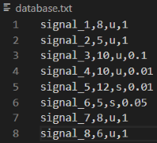

# CAN-Message-Decoder-Encoder
This python script will decode the signal values of a CAN datagram. The structure of the signals has to be defined in a text file.

## Structure of database.txt
signal name, bit length, signedness (u (unsigned) or s (signed)), factor

## Requirements
Python3 with numpy